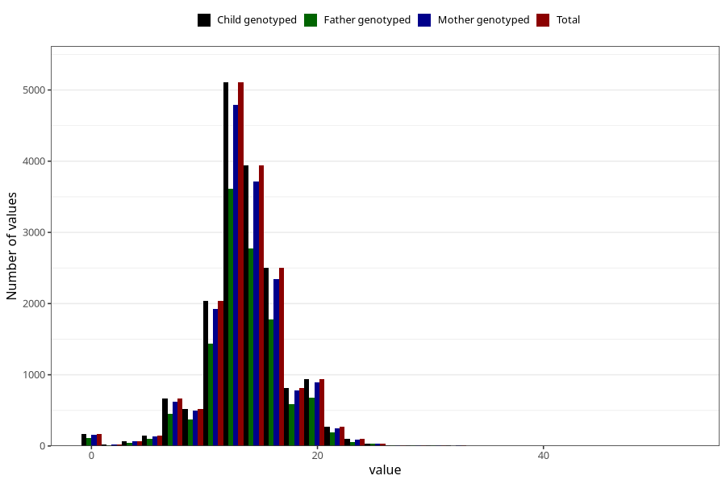

# vomiting_week_to_q2
Variable mapping to `BB858` in `Skjema2CDW_v12`.
- Number of values:

| Value | Total | Child genotyped | Mother genotyped | Father genotyped |
| ----- | ----- | --------------- | ---------------- | ---------------- |
| Missing | 63638 | 63638 | 60268 | 41362 |
| Non-missing | 17367 | 17367 | 16349 | 12242 |
| 25th percentile | 12 | 12 | 12 | 12 |
| 50th percentile | 13 | 13 | 13 | 13 |
| 75th percentile | 16 | 16 | 16 | 16 |
| Mean | 13.6020613807796 | 13.6020613807796 | 13.6055416233409 | 13.6392746283287 |
| Standard deviation | 3.64341776962603 | 3.64341776962603 | 3.65009140066861 | 3.60595950325491 |
| N | 17367 | 17367 | 16349 | 12242 |

