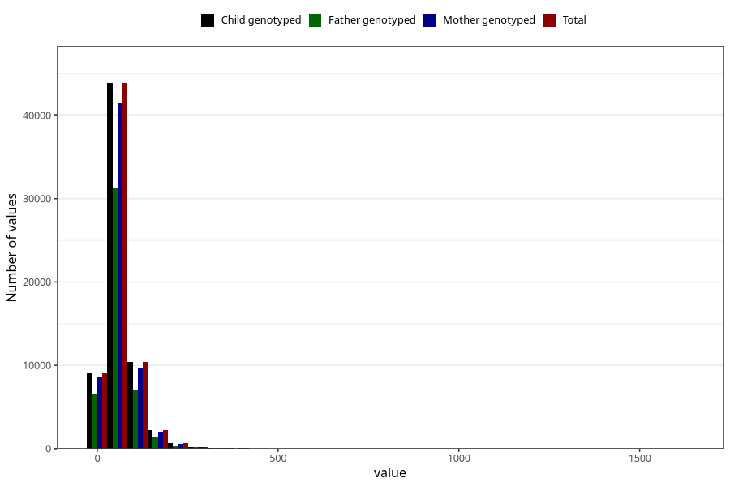

# added_sugar
Variable mapping to `SUKKER` in `Skjema2_beregning_CDW_v12`.
- Number of values:

| Value | Total | Child genotyped | Mother genotyped | Father genotyped |
| ----- | ----- | --------------- | ---------------- | ---------------- |
| Missing | 14320 | 14320 | 13635 | 6744 |
| Non-missing | 66685 | 66685 | 62982 | 46860 |
| 25th percentile | 36.15 | 36.15 | 36.11 | 35.95 |
| 50th percentile | 52.92 | 52.92 | 52.85 | 52.38 |
| 75th percentile | 76.84 | 76.84 | 76.74 | 75.66 |
| Mean | 63.0388504161356 | 63.0388504161356 | 62.9205264996348 | 61.9351229193342 |
| Standard deviation | 45.4082267660058 | 45.4082267660058 | 45.3377793401779 | 43.394242345575 |
| N | 66685 | 66685 | 62982 | 46860 |

