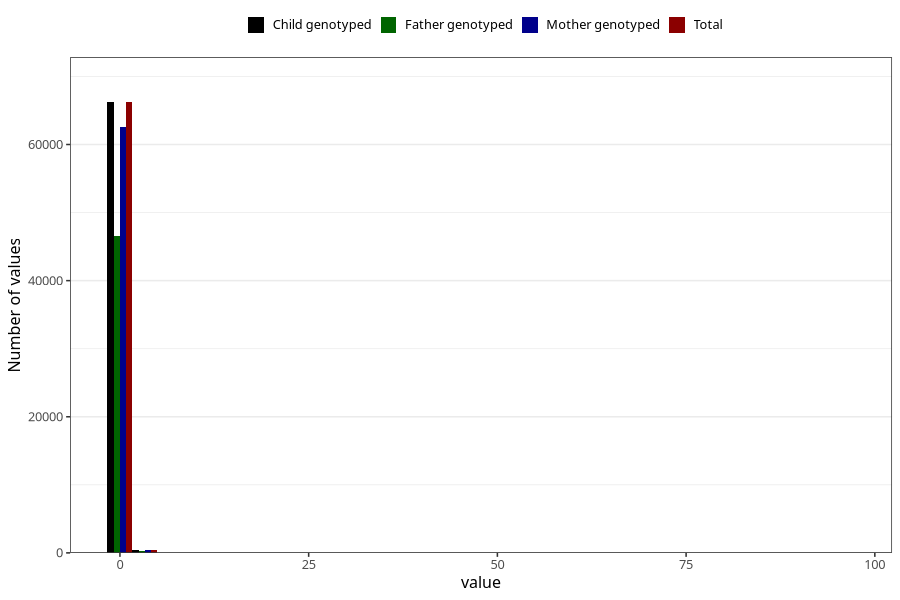

# alcohol
Variable mapping to `ALKOHOL` in `Skjema2_beregning_CDW_v12`.
- Number of values:

| Value | Total | Child genotyped | Mother genotyped | Father genotyped |
| ----- | ----- | --------------- | ---------------- | ---------------- |
| Missing | 14320 | 14320 | 13635 | 6744 |
| Non-missing | 66685 | 66685 | 62982 | 46860 |
| 25th percentile | 0 | 0 | 0 | 0 |
| 50th percentile | 0 | 0 | 0 | 0 |
| 75th percentile | 0 | 0 | 0 | 0 |
| Mean | 0.0773503786458724 | 0.0773503786458724 | 0.0773654377441174 | 0.071362782757149 |
| Standard deviation | 0.628266146871455 | 0.628266146871455 | 0.638742710949619 | 0.435731238512025 |
| N | 66685 | 66685 | 62982 | 46860 |

