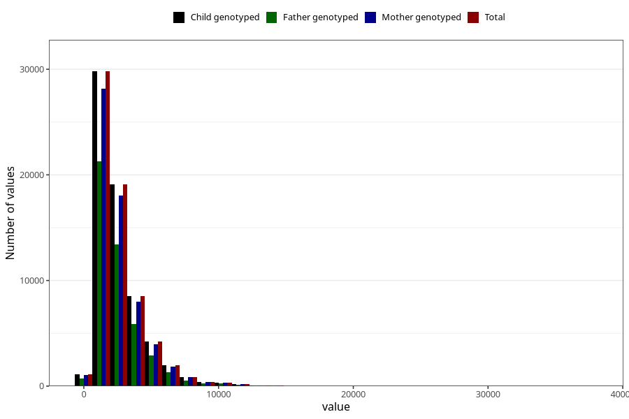

# beta_carotene
Variable mapping to `BETAKAROTEN` in `Skjema2_beregning_CDW_v12`.
- Number of values:

| Value | Total | Child genotyped | Mother genotyped | Father genotyped |
| ----- | ----- | --------------- | ---------------- | ---------------- |
| Missing | 14320 | 14320 | 13635 | 6744 |
| Non-missing | 66685 | 66685 | 62982 | 46860 |
| 25th percentile | 1452.77 | 1452.77 | 1452.4975 | 1445.2725 |
| 50th percentile | 2041.51 | 2041.51 | 2041.355 | 2023.75 |
| 75th percentile | 3233.62 | 3233.62 | 3233.17 | 3199.9625 |
| Mean | 2625.77840413886 | 2625.77840413886 | 2626.59420135912 | 2596.45108365344 |
| Standard deviation | 1867.83766499885 | 1867.83766499885 | 1867.00368259037 | 1839.72257019266 |
| N | 66685 | 66685 | 62982 | 46860 |

