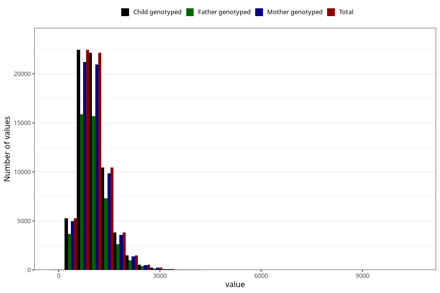

# calsium
Variable mapping to `KALSIUM` in `Skjema2_beregning_CDW_v12`.
- Number of values:

| Value | Total | Child genotyped | Mother genotyped | Father genotyped |
| ----- | ----- | --------------- | ---------------- | ---------------- |
| Missing | 14320 | 14320 | 13635 | 6744 |
| Non-missing | 66685 | 66685 | 62982 | 46860 |
| 25th percentile | 750.62 | 750.62 | 750.2375 | 749.68 |
| 50th percentile | 976.35 | 976.35 | 976.195 | 973.64 |
| 75th percentile | 1265.69 | 1265.69 | 1264.6075 | 1258.46 |
| Mean | 1056.29050985979 | 1056.29050985979 | 1055.32809707535 | 1049.8769340589 |
| Standard deviation | 474.523939090328 | 474.523939090328 | 473.855559912247 | 463.929324615033 |
| N | 66685 | 66685 | 62982 | 46860 |

