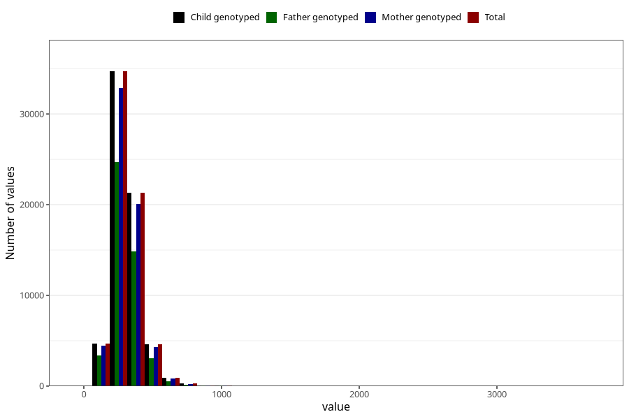

# carbohydrates
Variable mapping to `TOT_KARB` in `Skjema2_beregning_CDW_v12`.
- Number of values:

| Value | Total | Child genotyped | Mother genotyped | Father genotyped |
| ----- | ----- | --------------- | ---------------- | ---------------- |
| Missing | 14320 | 14320 | 13635 | 6744 |
| Non-missing | 66685 | 66685 | 62982 | 46860 |
| 25th percentile | 243.59 | 243.59 | 243.385 | 242.43 |
| 50th percentile | 295.86 | 295.86 | 295.67 | 294.245 |
| 75th percentile | 359.05 | 359.05 | 358.7875 | 355.99 |
| Mean | 311.420435330284 | 311.420435330284 | 311.135426153504 | 308.673295134443 |
| Standard deviation | 108.945676969121 | 108.945676969121 | 108.505851730638 | 104.786218578617 |
| N | 66685 | 66685 | 62982 | 46860 |

