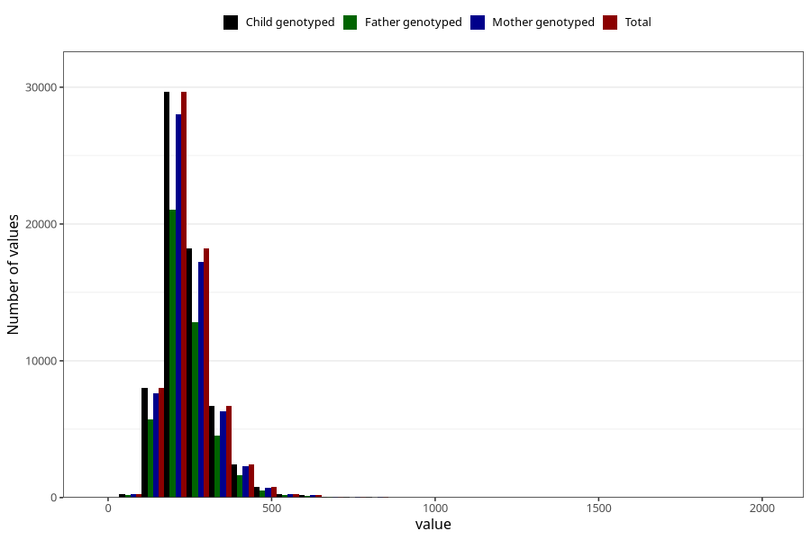

# cholesterol_mg
Variable mapping to `KOLESTEROL` in `Skjema2_beregning_CDW_v12`.
- Number of values:

| Value | Total | Child genotyped | Mother genotyped | Father genotyped |
| ----- | ----- | --------------- | ---------------- | ---------------- |
| Missing | 14320 | 14320 | 13635 | 6744 |
| Non-missing | 66685 | 66685 | 62982 | 46860 |
| 25th percentile | 192.67 | 192.67 | 192.5425 | 192.1775 |
| 50th percentile | 228.88 | 228.88 | 228.82 | 227.84 |
| 75th percentile | 278.79 | 278.79 | 278.48 | 276.9425 |
| Mean | 244.274004948639 | 244.274004948639 | 244.090751167 | 242.594894793 |
| Standard deviation | 80.6528214099799 | 80.6528214099799 | 80.4539685762103 | 78.3835914544609 |
| N | 66685 | 66685 | 62982 | 46860 |

