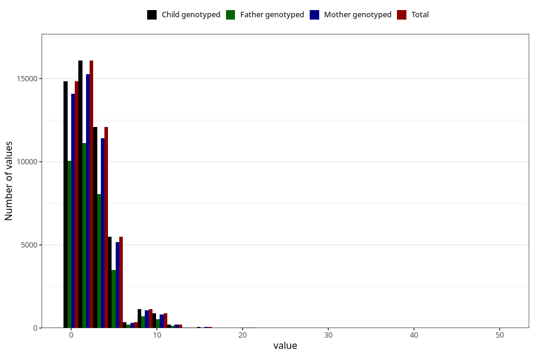

# coffee_before_filter
Variable mapping to `AA1377` in `Skjema1_v12`.
- Number of values:

| Value | Total | Child genotyped | Mother genotyped | Father genotyped |
| ----- | ----- | --------------- | ---------------- | ---------------- |
| Missing | 29759 | 29759 | 28085 | 19160 |
| Non-missing | 51246 | 51246 | 48532 | 34444 |
| Consumption have been reported by a mark but no amount given | 2 | 2 | 2 |1 |
| 25th percentile | 0 | 0 | 0 | 0 |
| 50th percentile | 2 | 2 | 2 | 2 |
| 75th percentile | 4 | 4 | 4 | 4 |
| Mean | 2.4336507688705 | 2.4336507688705 | 2.42540696476406 | 2.37023488081758 |
| Standard deviation | 2.51204934454225 | 2.51204934454225 | 2.50923195259245 | 2.44992095308769 |
| N | 51244 | 51244 | 48530 | 34443 |

