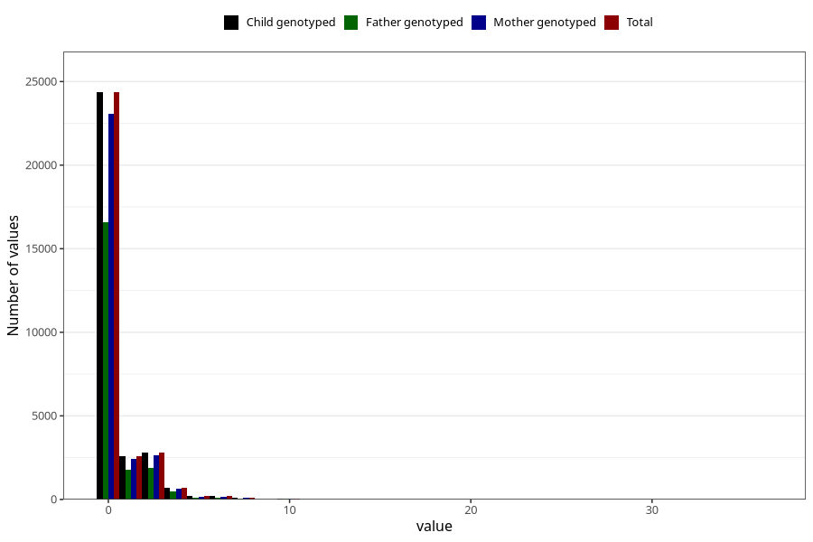

# coffee_before_instant
Variable mapping to `AA1380` in `Skjema1_v12`.
- Number of values:

| Value | Total | Child genotyped | Mother genotyped | Father genotyped |
| ----- | ----- | --------------- | ---------------- | ---------------- |
| Missing | 50035 | 50035 | 47289 | 32561 |
| Non-missing | 30970 | 30970 | 29328 | 21043 |
| Consumption have been reported by a mark but no amount given | 1 | 1 | 1 |0 |
| 0 | 24358 | 24358 | 23089 | 16611 |
| 1 | 2575 | 2575 | 2439 | 1763 |
| 2 | 2193 | 2193 | 2057 | 1461 |
| 3 | 605 | 605 | 580 | 407 |
| 4 | 686 | 686 | 641 | 456 |
| 5 | 194 | 194 | 182 | 118 |
| 6 | 191 | 191 | 181 | 116 |
| 7 | 22 | 22 | 22 | 16 |
| 8 | 81 | 81 | 75 | 53 |
| 9 | 2 | 2 | 2 | 2 |
| 10 | 47 | 47 | 45 | 30 |
| 12 | 7 | 7 | 7 | 4 |
| 14 | 2 | 2 | 2 | 2 |
| 15 | 3 | 3 | 2 | 3 |
| 16 | 1 | 1 | 1 | 1 |
| 24 | 1 | 1 | 1 | 0 |
| 36 | 1 | 1 | 1 | 0 |

