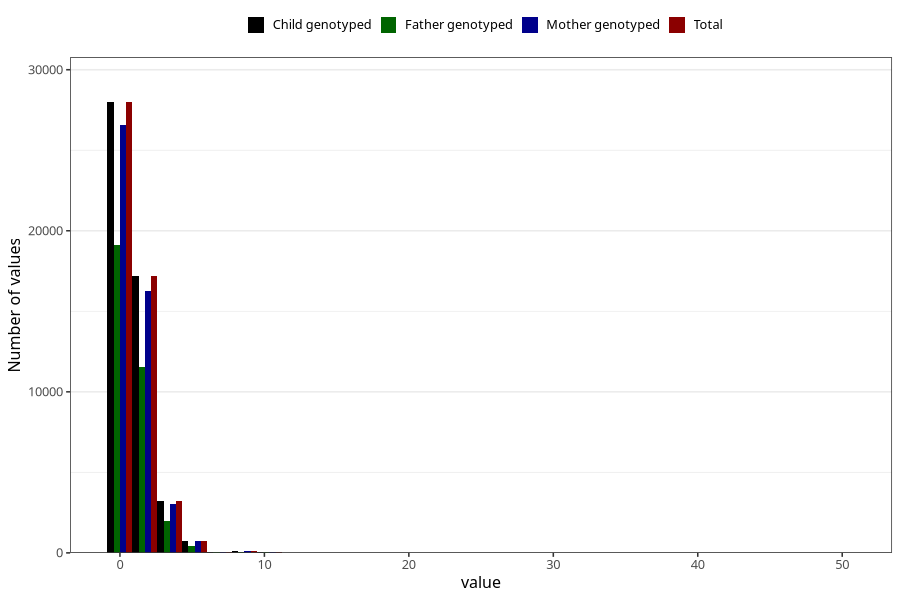

# coffee_during_filter
Variable mapping to `AA1378` in `Skjema1_v12`.
- Number of values:

| Value | Total | Child genotyped | Mother genotyped | Father genotyped |
| ----- | ----- | --------------- | ---------------- | ---------------- |
| Missing | 31563 | 31563 | 29813 | 20403 |
| Non-missing | 49442 | 49442 | 46804 | 33201 |
| 0 | 27984 | 27984 | 26542 | 19105 |
| 1 | 10412 | 10412 | 9868 | 7135 |
| 2 | 6791 | 6791 | 6380 | 4422 |
| 3 | 1835 | 1835 | 1711 | 1093 |
| 4 | 1407 | 1407 | 1345 | 895 |
| 5 | 420 | 420 | 396 | 243 |
| 6 | 341 | 341 | 321 | 179 |
| 7 | 38 | 38 | 37 | 24 |
| 8 | 103 | 103 | 99 | 57 |
| 9 | 5 | 5 | 4 | 2 |
| 10 | 74 | 74 | 71 | 33 |
| 12 | 20 | 20 | 19 | 7 |
| 14 | 1 | 1 | 1 | 1 |
| 15 | 1 | 1 | 1 | 1 |
| 16 | 2 | 2 | 1 | 0 |
| 20 | 6 | 6 | 6 | 3 |
| 25 | 1 | 1 | 1 | 1 |
| 50 | 1 | 1 | 1 | 0 |

