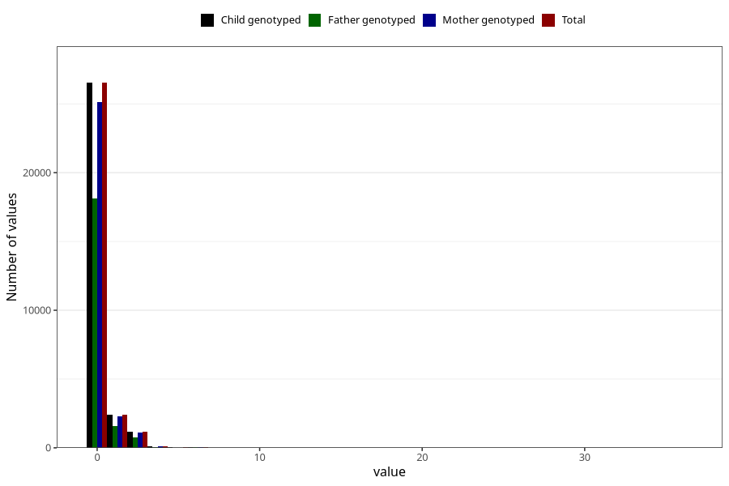

# coffee_during_instant
Variable mapping to `AA1381` in `Skjema1_v12`.
- Number of values:

| Value | Total | Child genotyped | Mother genotyped | Father genotyped |
| ----- | ----- | --------------- | ---------------- | ---------------- |
| Missing | 50659 | 50659 | 47876 | 32999 |
| Non-missing | 30346 | 30346 | 28741 | 20605 |
| 0 | 26534 | 26534 | 25132 | 18107 |
| 1 | 2419 | 2419 | 2295 | 1607 |
| 2 | 1018 | 1018 | 957 | 662 |
| 3 | 145 | 145 | 140 | 90 |
| 4 | 135 | 135 | 128 | 80 |
| 5 | 24 | 24 | 21 | 18 |
| 6 | 46 | 46 | 44 | 28 |
| 7 | 6 | 6 | 6 | 4 |
| 8 | 8 | 8 | 8 | 4 |
| 10 | 8 | 8 | 7 | 4 |
| 14 | 1 | 1 | 1 | 1 |
| 24 | 1 | 1 | 1 | 0 |
| 36 | 1 | 1 | 1 | 0 |

