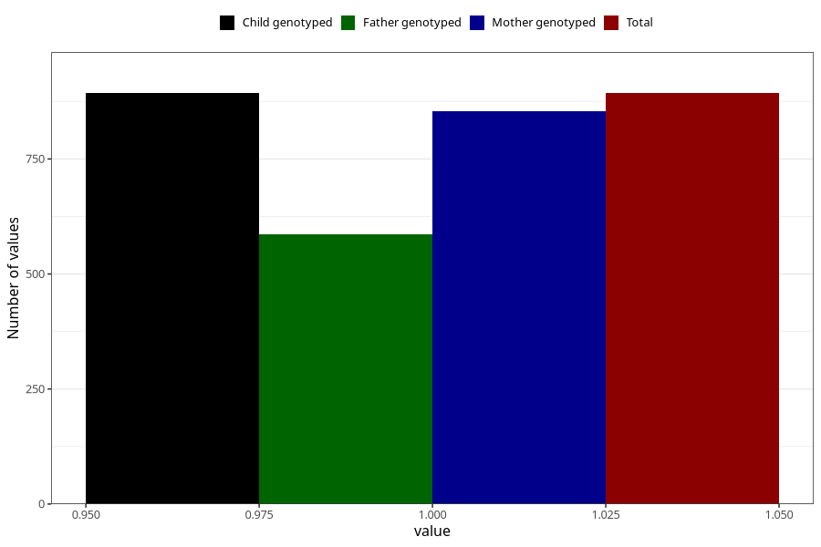

# coffee_instant_decaf
Variable mapping to `AA1382` in `Skjema1_v12`.
- Number of values:

| Value | Total | Child genotyped | Mother genotyped | Father genotyped |
| ----- | ----- | --------------- | ---------------- | ---------------- |
| Missing | 80112 | 80112 | 75763 | 53017 |
| Non-missing | 893 | 893 | 854 | 587 |
| 1 | 893 | 893 | 854 | 587 |

