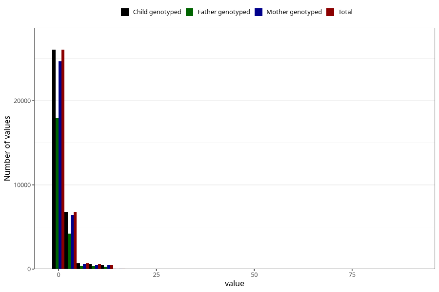

# coke_before
Variable mapping to `AA1392` in `Skjema1_v12`.
- Number of values:

| Value | Total | Child genotyped | Mother genotyped | Father genotyped |
| ----- | ----- | --------------- | ---------------- | ---------------- |
| Missing | 46402 | 46402 | 43866 | 30408 |
| Non-missing | 34603 | 34603 | 32751 | 23196 |
| Consumption have been reported by a mark but no amount given | 5 | 5 | 5 |2 |
| 25th percentile | 0 | 0 | 0 | 0 |
| 50th percentile | 0 | 0 | 0 | 0 |
| 75th percentile | 1 | 1 | 1 | 1 |
| Mean | 1.1922943522747 | 1.1922943522747 | 1.18863372625664 | 1.10869190307838 |
| Standard deviation | 2.33510544764854 | 2.33510544764854 | 2.33157543103839 | 2.28338719880286 |
| N | 34598 | 34598 | 32746 | 23194 |

