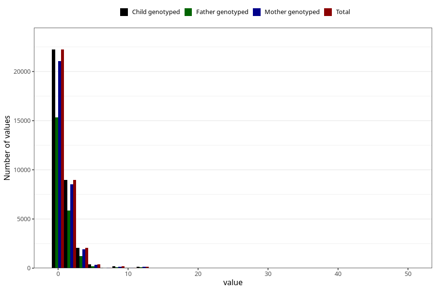

# coke_during
Variable mapping to `AA1393` in `Skjema1_v12`.
- Number of values:

| Value | Total | Child genotyped | Mother genotyped | Father genotyped |
| ----- | ----- | --------------- | ---------------- | ---------------- |
| Missing | 46930 | 46930 | 44334 | 30730 |
| Non-missing | 34075 | 34075 | 32283 | 22874 |
| Consumption have been reported by a mark but no amount given | 3 | 3 | 3 |1 |
| 25th percentile | 0 | 0 | 0 | 0 |
| 50th percentile | 0 | 0 | 0 | 0 |
| 75th percentile | 1 | 1 | 1 | 1 |
| Mean | 0.763207325663301 | 0.763207325663301 | 0.763228004956629 | 0.705854063743278 |
| Standard deviation | 1.64432702215821 | 1.64432702215821 | 1.649903998419 | 1.59979047985547 |
| N | 34072 | 34072 | 32280 | 22873 |

