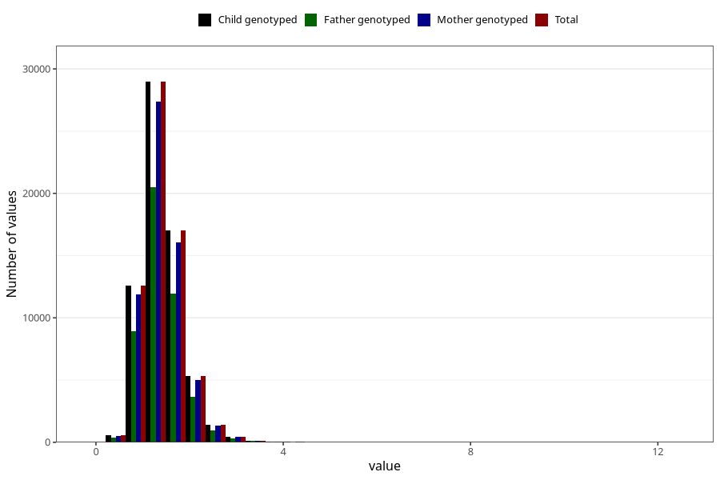

# copper
Variable mapping to `KOPPER` in `Skjema2_beregning_CDW_v12`.
- Number of values:

| Value | Total | Child genotyped | Mother genotyped | Father genotyped |
| ----- | ----- | --------------- | ---------------- | ---------------- |
| Missing | 14320 | 14320 | 13635 | 6744 |
| Non-missing | 66685 | 66685 | 62982 | 46860 |
| 25th percentile | 1.12 | 1.12 | 1.12 | 1.12 |
| 50th percentile | 1.35 | 1.35 | 1.35 | 1.35 |
| 75th percentile | 1.63 | 1.63 | 1.63 | 1.62 |
| Mean | 1.41618489915273 | 1.41618489915273 | 1.41524340287701 | 1.40819867690994 |
| Standard deviation | 0.463296774312771 | 0.463296774312771 | 0.462010397003291 | 0.45012133944151 |
| N | 66685 | 66685 | 62982 | 46860 |

