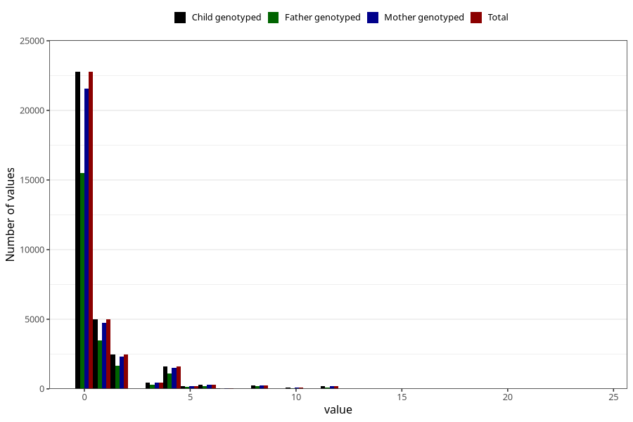

# diet_coke_during
Variable mapping to `AA1399` in `Skjema1_v12`.
- Number of values:

| Value | Total | Child genotyped | Mother genotyped | Father genotyped |
| ----- | ----- | --------------- | ---------------- | ---------------- |
| Missing | 47577 | 47577 | 44989 | 30784 |
| Non-missing | 33428 | 33428 | 31628 | 22820 |
| Consumption have been reported by a mark but no amount given | 3 | 3 | 2 |1 |
| 25th percentile | 0 | 0 | 0 | 0 |
| 50th percentile | 0 | 0 | 0 | 0 |
| 75th percentile | 1 | 1 | 1 | 1 |
| Mean | 0.807419596110696 | 0.807419596110696 | 0.806804527920066 | 0.788158990315088 |
| Standard deviation | 1.81560308179603 | 1.81560308179603 | 1.81433532437301 | 1.75227536436072 |
| N | 33425 | 33425 | 31626 | 22819 |

