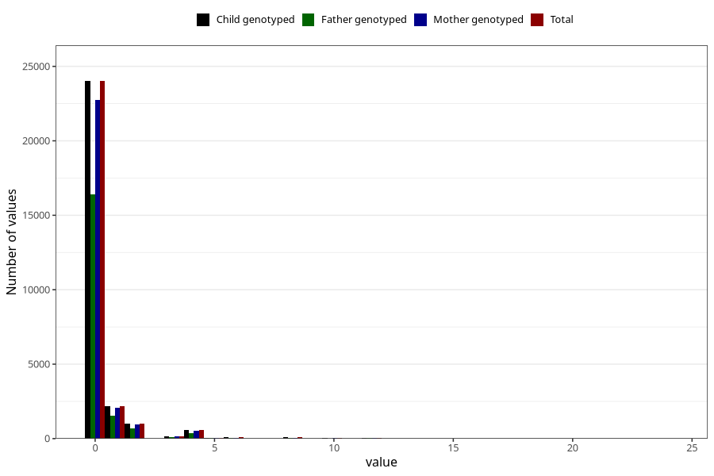

# diet_soda_during
Variable mapping to `AA1402` in `Skjema1_v12`.
- Number of values:

| Value | Total | Child genotyped | Mother genotyped | Father genotyped |
| ----- | ----- | --------------- | ---------------- | ---------------- |
| Missing | 52749 | 52749 | 49863 | 34288 |
| Non-missing | 28256 | 28256 | 26754 | 19316 |
| Consumption have been reported by a mark but no amount given | 2 | 2 | 2 |1 |
| 0 | 24013 | 24013 | 22738 | 16415 |
| 1 | 2192 | 2192 | 2081 | 1524 |
| 2 | 991 | 991 | 941 | 688 |
| 3 | 152 | 152 | 142 | 104 |
| 4 | 577 | 577 | 545 | 367 |
| 5 | 60 | 60 | 53 | 33 |
| 6 | 74 | 74 | 70 | 58 |
| 7 | 11 | 11 | 10 | 9 |
| 8 | 74 | 74 | 72 | 53 |
| 9 | 3 | 3 | 3 | 1 |
| 10 | 29 | 29 | 26 | 12 |
| 12 | 71 | 71 | 65 | 45 |
| 16 | 4 | 4 | 3 | 3 |
| 18 | 1 | 1 | 1 | 1 |
| 20 | 1 | 1 | 1 | 1 |
| 24 | 1 | 1 | 1 | 1 |

