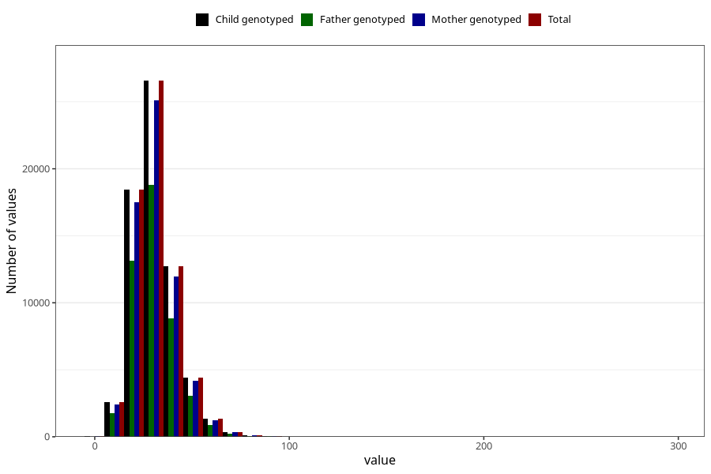

# dietary_fiber
Variable mapping to `FIBER` in `Skjema2_beregning_CDW_v12`.
- Number of values:

| Value | Total | Child genotyped | Mother genotyped | Father genotyped |
| ----- | ----- | --------------- | ---------------- | ---------------- |
| Missing | 14320 | 14320 | 13635 | 6744 |
| Non-missing | 66685 | 66685 | 62982 | 46860 |
| 25th percentile | 23.62 | 23.62 | 23.61 | 23.58 |
| 50th percentile | 29.5 | 29.5 | 29.48 | 29.38 |
| 75th percentile | 36.65 | 36.65 | 36.64 | 36.46 |
| Mean | 31.0848844567744 | 31.0848844567744 | 31.0689606554254 | 30.9207712334614 |
| Standard deviation | 11.4291863770873 | 11.4291863770873 | 11.4007457312661 | 11.186282717795 |
| N | 66685 | 66685 | 62982 | 46860 |

