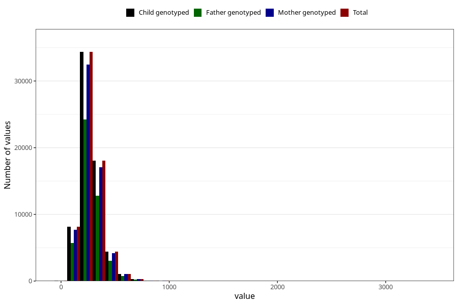

# folate
Variable mapping to `FOLAT` in `Skjema2_beregning_CDW_v12`.
- Number of values:

| Value | Total | Child genotyped | Mother genotyped | Father genotyped |
| ----- | ----- | --------------- | ---------------- | ---------------- |
| Missing | 14320 | 14320 | 13635 | 6744 |
| Non-missing | 66685 | 66685 | 62982 | 46860 |
| 25th percentile | 208.17 | 208.17 | 208.13 | 207.94 |
| 50th percentile | 261.21 | 261.21 | 261.04 | 260.61 |
| 75th percentile | 326.37 | 326.37 | 325.9675 | 325.52 |
| Mean | 278.079062757742 | 278.079062757742 | 277.77523832206 | 276.704512377294 |
| Standard deviation | 109.114364118312 | 109.114364118312 | 108.517493043698 | 106.097314870224 |
| N | 66685 | 66685 | 62982 | 46860 |

