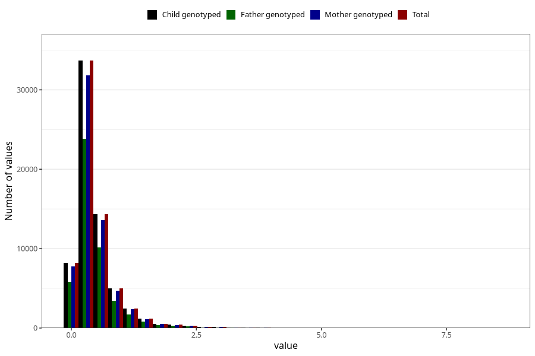

# food_LCn3_g_day
Variable mapping to `f_sum_LCn3` in `Skjema2_beregning_CDW_foody_fatty_acid_and_iodine_v12`.
- Number of values:

| Value | Total | Child genotyped | Mother genotyped | Father genotyped |
| ----- | ----- | --------------- | ---------------- | ---------------- |
| Missing | 14320 | 14320 | 13635 | 6744 |
| Non-missing | 66685 | 66685 | 62982 | 46860 |
| 25th percentile | 0.2219 | 0.2219 | 0.2218 | 0.2226 |
| 50th percentile | 0.3557 | 0.3557 | 0.3555 | 0.35605 |
| 75th percentile | 0.5671 | 0.5671 | 0.566275 | 0.5625 |
| Mean | 0.476000494863912 | 0.476000494863912 | 0.475549615763234 | 0.471735625266752 |
| Standard deviation | 0.442380509288729 | 0.442380509288729 | 0.441664655226894 | 0.433425464123787 |
| N | 66685 | 66685 | 62982 | 46860 |

