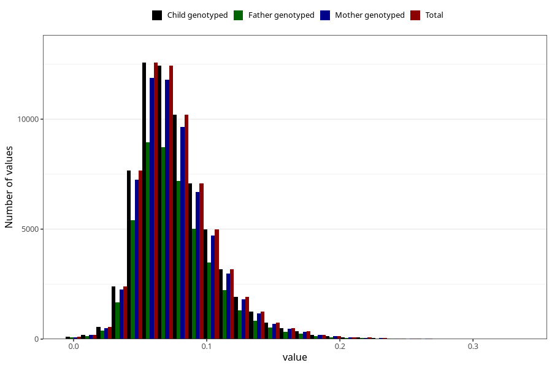

# food_aa_g_day
Variable mapping to `f_aa` in `Skjema2_beregning_CDW_foody_fatty_acid_and_iodine_v12`.
- Number of values:

| Value | Total | Child genotyped | Mother genotyped | Father genotyped |
| ----- | ----- | --------------- | ---------------- | ---------------- |
| Missing | 14320 | 14320 | 13635 | 6744 |
| Non-missing | 66685 | 66685 | 62982 | 46860 |
| 25th percentile | 0.0571 | 0.0571 | 0.0571 | 0.057 |
| 50th percentile | 0.0721 | 0.0721 | 0.0721 | 0.0719 |
| 75th percentile | 0.0919 | 0.0919 | 0.0919 | 0.0916 |
| Mean | 0.0773485236559946 | 0.0773485236559946 | 0.0773318757740307 | 0.0770733781476739 |
| Standard deviation | 0.029739055585816 | 0.029739055585816 | 0.0296818508437895 | 0.0293695883426831 |
| N | 66685 | 66685 | 62982 | 46860 |

