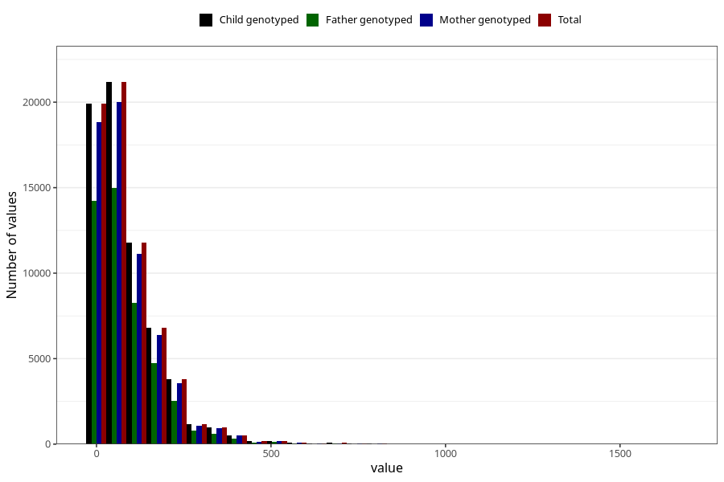

# food_caffeine_total
Variable mapping to `f_caff_tot` in `Skjema2_beregning_CDW_caffeine_food_and_supplements_v12`.
- Number of values:

| Value | Total | Child genotyped | Mother genotyped | Father genotyped |
| ----- | ----- | --------------- | ---------------- | ---------------- |
| Missing | 14320 | 14320 | 13635 | 6744 |
| Non-missing | 66685 | 66685 | 62982 | 46860 |
| 25th percentile | 23.2665 | 23.2665 | 23.250825 | 22.810875 |
| 50th percentile | 59.2502 | 59.2502 | 59.0867 | 57.82415 |
| 75th percentile | 123.508 | 123.508 | 123.338 | 121.01445 |
| Mean | 89.5266188318213 | 89.5266188318213 | 89.3336846892763 | 87.2363752987623 |
| Standard deviation | 94.156872220858 | 94.156872220858 | 93.9417440100621 | 90.8926634154463 |
| N | 66685 | 66685 | 62982 | 46860 |

