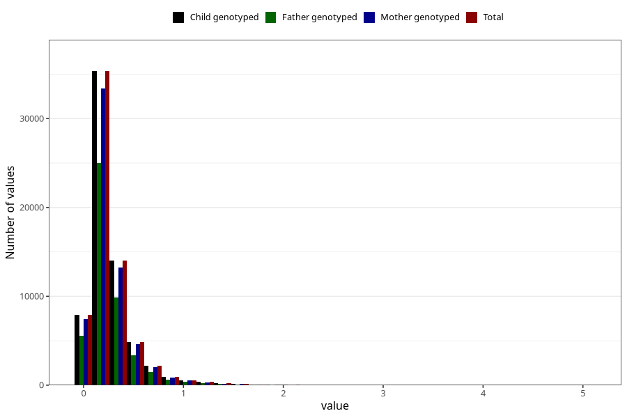

# food_dha_g_day
Variable mapping to `f_dha` in `Skjema2_beregning_CDW_foody_fatty_acid_and_iodine_v12`.
- Number of values:

| Value | Total | Child genotyped | Mother genotyped | Father genotyped |
| ----- | ----- | --------------- | ---------------- | ---------------- |
| Missing | 14320 | 14320 | 13635 | 6744 |
| Non-missing | 66685 | 66685 | 62982 | 46860 |
| 25th percentile | 0.1289 | 0.1289 | 0.1288 | 0.1292 |
| 50th percentile | 0.2025 | 0.2025 | 0.2024 | 0.2024 |
| 75th percentile | 0.3199 | 0.3199 | 0.3195 | 0.3168 |
| Mean | 0.267372254629977 | 0.267372254629977 | 0.267106285922962 | 0.264779654289373 |
| Standard deviation | 0.241317494015714 | 0.241317494015714 | 0.240867087466322 | 0.236182749441779 |
| N | 66685 | 66685 | 62982 | 46860 |

