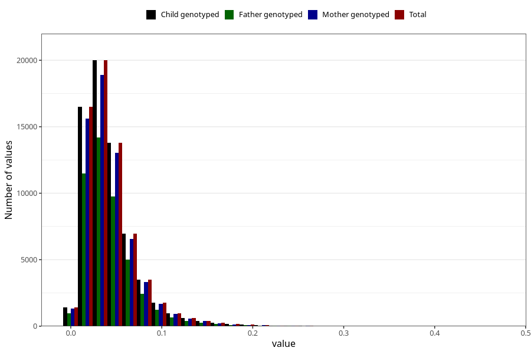

# food_dpa_g_day
Variable mapping to `f_dpa` in `Skjema2_beregning_CDW_foody_fatty_acid_and_iodine_v12`.
- Number of values:

| Value | Total | Child genotyped | Mother genotyped | Father genotyped |
| ----- | ----- | --------------- | ---------------- | ---------------- |
| Missing | 14320 | 14320 | 13635 | 6744 |
| Non-missing | 66685 | 66685 | 62982 | 46860 |
| 25th percentile | 0.0233 | 0.0233 | 0.0233 | 0.0234 |
| 50th percentile | 0.0365 | 0.0365 | 0.0365 | 0.0366 |
| 75th percentile | 0.0539 | 0.0539 | 0.0538 | 0.0537 |
| Mean | 0.0430800314913399 | 0.0430800314913399 | 0.0430576672700137 | 0.0428794088775075 |
| Standard deviation | 0.030346501368547 | 0.030346501368547 | 0.0303317000243096 | 0.0297434801444273 |
| N | 66685 | 66685 | 62982 | 46860 |

