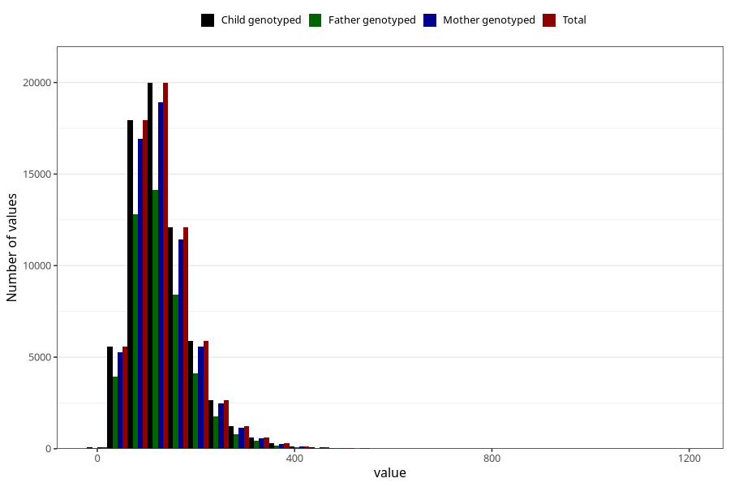

# food_iodine_mcg_day
Variable mapping to `f_jod` in `Skjema2_beregning_CDW_foody_fatty_acid_and_iodine_v12`.
- Number of values:

| Value | Total | Child genotyped | Mother genotyped | Father genotyped |
| ----- | ----- | --------------- | ---------------- | ---------------- |
| Missing | 14320 | 14320 | 13635 | 6744 |
| Non-missing | 66685 | 66685 | 62982 | 46860 |
| 25th percentile | 88.5312 | 88.5312 | 88.5246 | 88.167475 |
| 50th percentile | 121.2463 | 121.2463 | 121.2586 | 120.40725 |
| 75th percentile | 161.6766 | 161.6766 | 161.50595 | 160.434275 |
| Mean | 132.412634865412 | 132.412634865412 | 132.334645168461 | 131.217399052497 |
| Standard deviation | 65.8114279024352 | 65.8114279024352 | 65.796427091964 | 64.4271514408927 |
| N | 66685 | 66685 | 62982 | 46860 |

