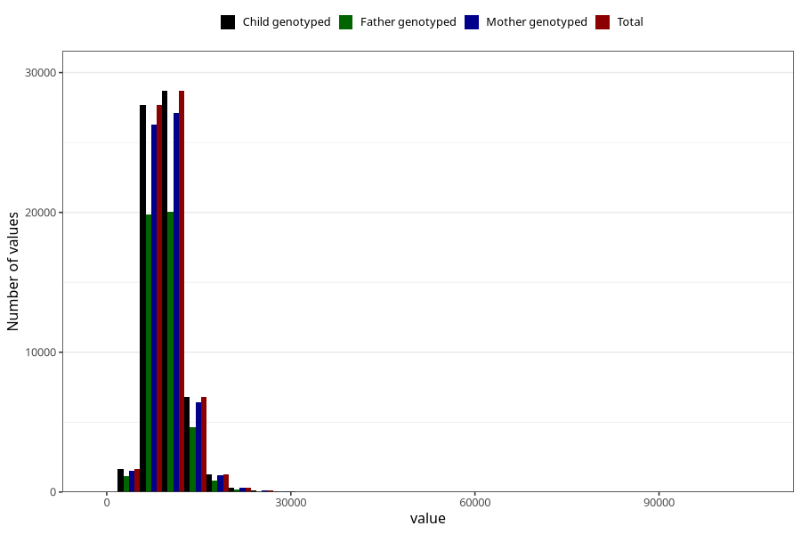

# food_kJ_day
Variable mapping to `f_kJ` in `Skjema2_beregning_CDW_caffeine_food_and_supplements_v12`.
- Number of values:

| Value | Total | Child genotyped | Mother genotyped | Father genotyped |
| ----- | ----- | --------------- | ---------------- | ---------------- |
| Missing | 14320 | 14320 | 13635 | 6744 |
| Non-missing | 66685 | 66685 | 62982 | 46860 |
| 25th percentile | 7890.3 | 7890.3 | 7886.385 | 7854.945 |
| 50th percentile | 9372.97 | 9372.97 | 9363.57 | 9315.65 |
| 75th percentile | 11167.72 | 11167.72 | 11158.505 | 11082.0375 |
| Mean | 9799.94890440129 | 9799.94890440129 | 9791.7073527357 | 9715.33137387964 |
| Standard deviation | 3073.40122857895 | 3073.40122857895 | 3061.99089102245 | 2951.11265211586 |
| N | 66685 | 66685 | 62982 | 46860 |

