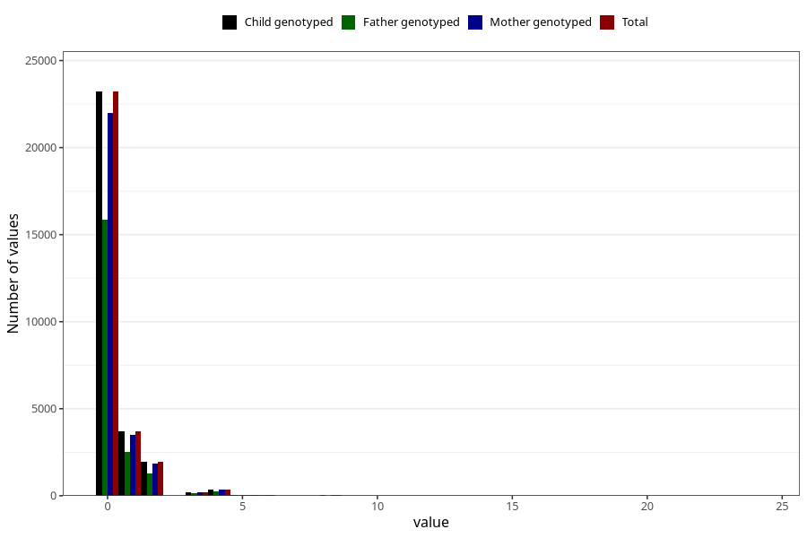

# herbal_tea_before
Variable mapping to `AA1389` in `Skjema1_v12`.
- Number of values:

| Value | Total | Child genotyped | Mother genotyped | Father genotyped |
| ----- | ----- | --------------- | ---------------- | ---------------- |
| Missing | 51435 | 51435 | 48575 | 33446 |
| Non-missing | 29570 | 29570 | 28042 | 20158 |
| 0 | 23214 | 23214 | 21999 | 15841 |
| 1 | 3691 | 3691 | 3512 | 2539 |
| 2 | 1929 | 1929 | 1830 | 1301 |
| 3 | 219 | 219 | 208 | 138 |
| 4 | 345 | 345 | 330 | 231 |
| 5 | 36 | 36 | 35 | 24 |
| 6 | 63 | 63 | 61 | 43 |
| 7 | 12 | 12 | 11 | 6 |
| 8 | 27 | 27 | 24 | 15 |
| 9 | 3 | 3 | 2 | 2 |
| 10 | 16 | 16 | 15 | 6 |
| 12 | 11 | 11 | 11 | 10 |
| 14 | 1 | 1 | 1 | 1 |
| 16 | 1 | 1 | 1 | 1 |
| 20 | 1 | 1 | 1 | 0 |
| 24 | 1 | 1 | 1 | 0 |

