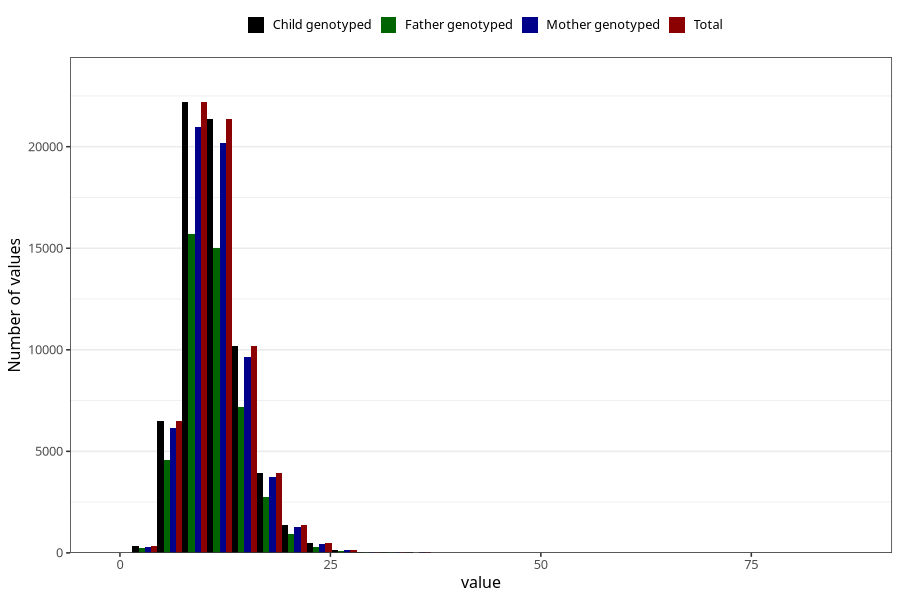

# iron
Variable mapping to `JERN` in `Skjema2_beregning_CDW_v12`.
- Number of values:

| Value | Total | Child genotyped | Mother genotyped | Father genotyped |
| ----- | ----- | --------------- | ---------------- | ---------------- |
| Missing | 14320 | 14320 | 13635 | 6744 |
| Non-missing | 66685 | 66685 | 62982 | 46860 |
| 25th percentile | 8.92 | 8.92 | 8.91 | 8.91 |
| 50th percentile | 10.86 | 10.86 | 10.86 | 10.84 |
| 75th percentile | 13.25 | 13.25 | 13.24 | 13.21 |
| Mean | 11.386548549149 | 11.386548549149 | 11.3799934902035 | 11.3417631241997 |
| Standard deviation | 3.7312069325978 | 3.7312069325978 | 3.72024478820338 | 3.64648110461746 |
| N | 66685 | 66685 | 62982 | 46860 |

