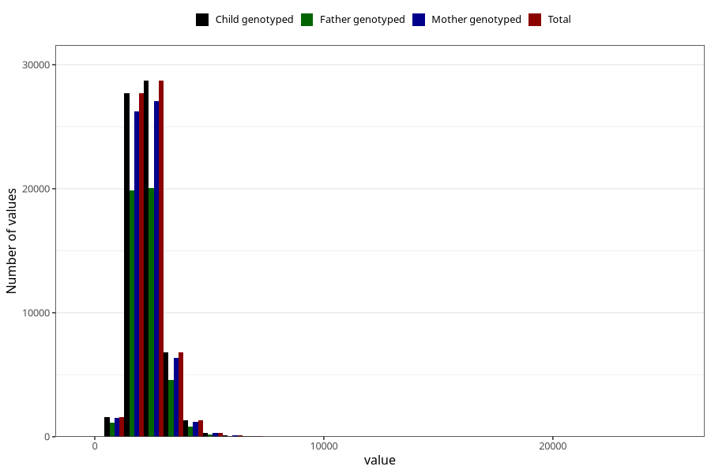

# kcal
Variable mapping to `KCAL` in `Skjema2_beregning_CDW_v12`.
- Number of values:

| Value | Total | Child genotyped | Mother genotyped | Father genotyped |
| ----- | ----- | --------------- | ---------------- | ---------------- |
| Missing | 14320 | 14320 | 13635 | 6744 |
| Non-missing | 66685 | 66685 | 62982 | 46860 |
| 25th percentile | 1876.47 | 1876.47 | 1875.4875 | 1867.95 |
| 50th percentile | 2229.01 | 2229.01 | 2227.3 | 2214.785 |
| 75th percentile | 2655.69 | 2655.69 | 2653.76 | 2635.705 |
| Mean | 2330.45985214066 | 2330.45985214066 | 2328.50406528849 | 2310.39799615877 |
| Standard deviation | 729.830567375616 | 729.830567375616 | 727.13722809783 | 701.207206743243 |
| N | 66685 | 66685 | 62982 | 46860 |

