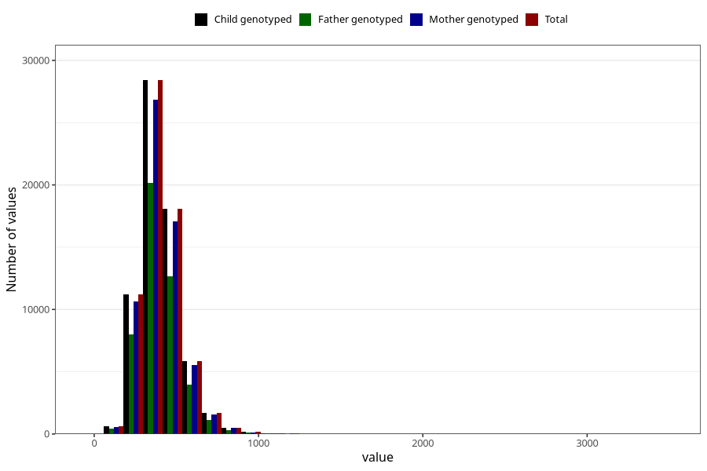

# magnesium
Variable mapping to `MAGNESIUM` in `Skjema2_beregning_CDW_v12`.
- Number of values:

| Value | Total | Child genotyped | Mother genotyped | Father genotyped |
| ----- | ----- | --------------- | ---------------- | ---------------- |
| Missing | 14320 | 14320 | 13635 | 6744 |
| Non-missing | 66685 | 66685 | 62982 | 46860 |
| 25th percentile | 320.64 | 320.64 | 320.4 | 319.6175 |
| 50th percentile | 387.9 | 387.9 | 387.645 | 386.05 |
| 75th percentile | 467.68 | 467.68 | 467.4175 | 464.98 |
| Mean | 404.998611831746 | 404.998611831746 | 404.718661681115 | 402.506182031583 |
| Standard deviation | 131.351013401497 | 131.351013401497 | 131.054257081063 | 127.738209061502 |
| N | 66685 | 66685 | 62982 | 46860 |

