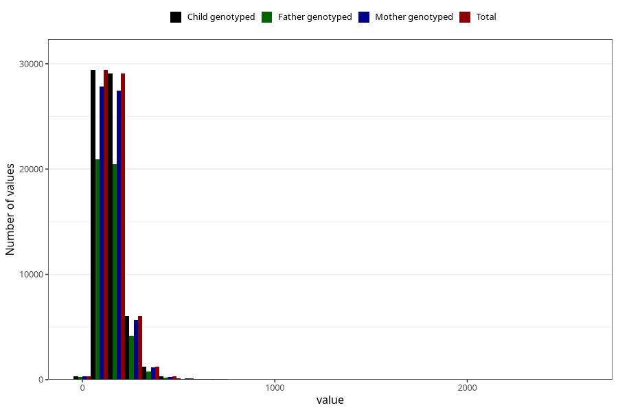

# mono_and_disaccharides
Variable mapping to `MONO_DISAKK` in `Skjema2_beregning_CDW_v12`.
- Number of values:

| Value | Total | Child genotyped | Mother genotyped | Father genotyped |
| ----- | ----- | --------------- | ---------------- | ---------------- |
| Missing | 14320 | 14320 | 13635 | 6744 |
| Non-missing | 66685 | 66685 | 62982 | 46860 |
| 25th percentile | 108.26 | 108.26 | 108.13 | 107.6175 |
| 50th percentile | 140.17 | 140.17 | 139.99 | 139.34 |
| 75th percentile | 181.17 | 181.17 | 180.9975 | 179.7125 |
| Mean | 152.872717852591 | 152.872717852591 | 152.670880886603 | 151.221031796842 |
| Standard deviation | 73.0533489651949 | 73.0533489651949 | 72.8366252534163 | 70.1288911049163 |
| N | 66685 | 66685 | 62982 | 46860 |

