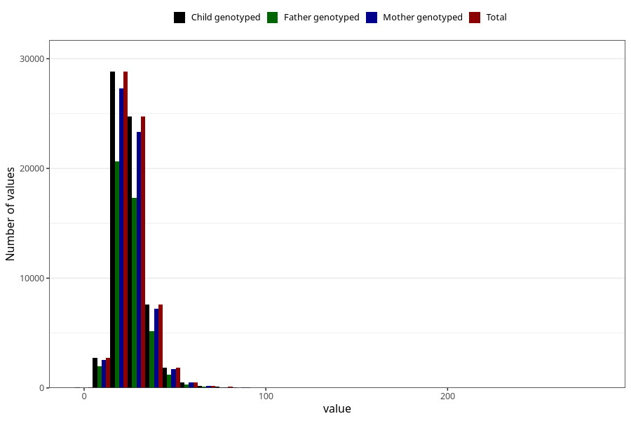

# monounsaturated_fatty_acids
Variable mapping to `ENUMETTET` in `Skjema2_beregning_CDW_v12`.
- Number of values:

| Value | Total | Child genotyped | Mother genotyped | Father genotyped |
| ----- | ----- | --------------- | ---------------- | ---------------- |
| Missing | 14320 | 14320 | 13635 | 6744 |
| Non-missing | 66685 | 66685 | 62982 | 46860 |
| 25th percentile | 19.98 | 19.98 | 19.98 | 19.86 |
| 50th percentile | 24.5 | 24.5 | 24.48 | 24.33 |
| 75th percentile | 30.14 | 30.14 | 30.1 | 29.91 |
| Mean | 26.0132511059459 | 26.0132511059459 | 25.9906936902607 | 25.7753653435766 |
| Standard deviation | 9.40367709910477 | 9.40367709910477 | 9.39559589890373 | 9.10449457495364 |
| N | 66685 | 66685 | 62982 | 46860 |

