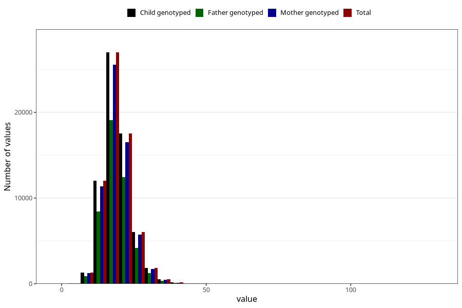

# niacin
Variable mapping to `NIACIN` in `Skjema2_beregning_CDW_v12`.
- Number of values:

| Value | Total | Child genotyped | Mother genotyped | Father genotyped |
| ----- | ----- | --------------- | ---------------- | ---------------- |
| Missing | 14320 | 14320 | 13635 | 6744 |
| Non-missing | 66685 | 66685 | 62982 | 46860 |
| 25th percentile | 16.08 | 16.08 | 16.08 | 16.08 |
| 50th percentile | 18.75 | 18.75 | 18.74 | 18.74 |
| 75th percentile | 21.84 | 21.84 | 21.82 | 21.79 |
| Mean | 19.3071294893904 | 19.3071294893904 | 19.2984662284462 | 19.2546182244985 |
| Standard deviation | 5.03924682097305 | 5.03924682097305 | 5.02485762275769 | 4.89957772735142 |
| N | 66685 | 66685 | 62982 | 46860 |

