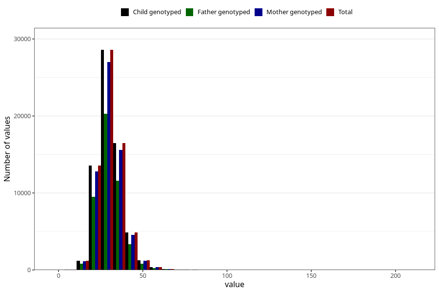

# niacin_eq
Variable mapping to `NIACIN_EQ` in `Skjema2_beregning_CDW_v12`.
- Number of values:

| Value | Total | Child genotyped | Mother genotyped | Father genotyped |
| ----- | ----- | --------------- | ---------------- | ---------------- |
| Missing | 14320 | 14320 | 13635 | 6744 |
| Non-missing | 66685 | 66685 | 62982 | 46860 |
| 25th percentile | 25.77 | 25.77 | 25.77 | 25.75 |
| 50th percentile | 29.86 | 29.86 | 29.84 | 29.77 |
| 75th percentile | 34.56 | 34.56 | 34.54 | 34.45 |
| Mean | 30.72915738172 | 30.72915738172 | 30.714156901972 | 30.617810926163 |
| Standard deviation | 7.81472896332425 | 7.81472896332425 | 7.79445144080527 | 7.59863775240572 |
| N | 66685 | 66685 | 62982 | 46860 |

