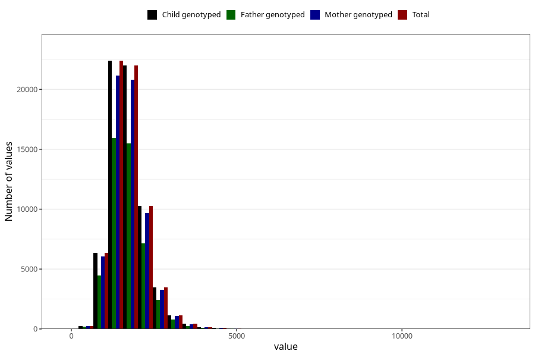

# phosphorus
Variable mapping to `FOSFOR` in `Skjema2_beregning_CDW_v12`.
- Number of values:

| Value | Total | Child genotyped | Mother genotyped | Father genotyped |
| ----- | ----- | --------------- | ---------------- | ---------------- |
| Missing | 14320 | 14320 | 13635 | 6744 |
| Non-missing | 66685 | 66685 | 62982 | 46860 |
| 25th percentile | 1350.48 | 1350.48 | 1350 | 1347.805 |
| 50th percentile | 1640.42 | 1640.42 | 1640.435 | 1634.64 |
| 75th percentile | 1987.17 | 1987.17 | 1985.9775 | 1978.3375 |
| Mean | 1715.78096693409 | 1715.78096693409 | 1714.7260995205 | 1707.23838860435 |
| Standard deviation | 559.917493748054 | 559.917493748054 | 558.990253135077 | 546.979069540249 |
| N | 66685 | 66685 | 62982 | 46860 |

