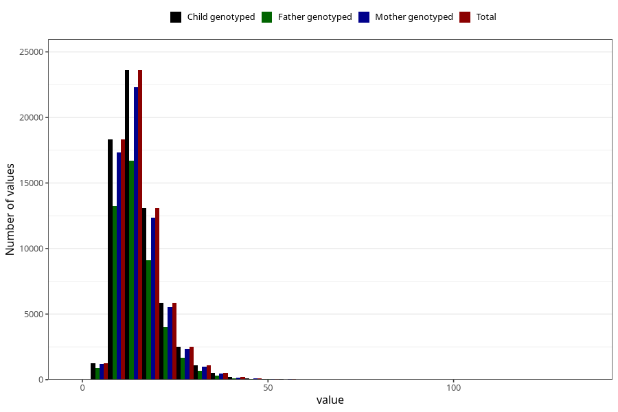

# polyunsaturated_fatty_acids
Variable mapping to `FLERUMETTET` in `Skjema2_beregning_CDW_v12`.
- Number of values:

| Value | Total | Child genotyped | Mother genotyped | Father genotyped |
| ----- | ----- | --------------- | ---------------- | ---------------- |
| Missing | 14320 | 14320 | 13635 | 6744 |
| Non-missing | 66685 | 66685 | 62982 | 46860 |
| 25th percentile | 11.01 | 11.01 | 11.01 | 10.93 |
| 50th percentile | 13.97 | 13.97 | 13.96 | 13.83 |
| 75th percentile | 18.08 | 18.08 | 18.07 | 17.88 |
| Mean | 15.2877560170953 | 15.2877560170953 | 15.2770266107777 | 15.1129573196756 |
| Standard deviation | 6.35946202868289 | 6.35946202868289 | 6.34270205050108 | 6.1769778643186 |
| N | 66685 | 66685 | 62982 | 46860 |

