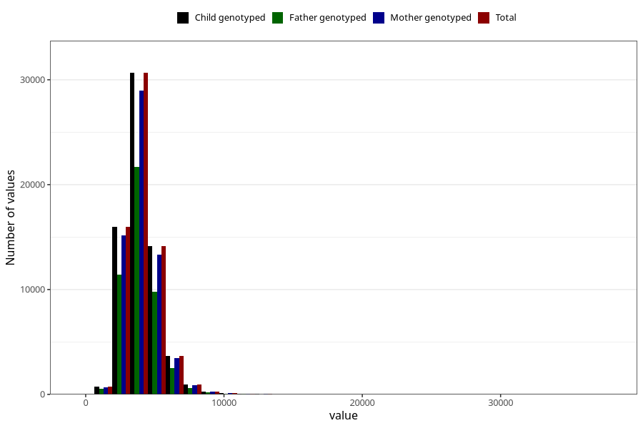

# potassium
Variable mapping to `KALIUM` in `Skjema2_beregning_CDW_v12`.
- Number of values:

| Value | Total | Child genotyped | Mother genotyped | Father genotyped |
| ----- | ----- | --------------- | ---------------- | ---------------- |
| Missing | 14320 | 14320 | 13635 | 6744 |
| Non-missing | 66685 | 66685 | 62982 | 46860 |
| 25th percentile | 3214.18 | 3214.18 | 3212.945 | 3202.4075 |
| 50th percentile | 3870.68 | 3870.68 | 3869.3 | 3854.685 |
| 75th percentile | 4653.81 | 4653.81 | 4649.7325 | 4624.6 |
| Mean | 4047.18531063957 | 4047.18531063957 | 4044.68125575561 | 4020.73364810073 |
| Standard deviation | 1313.82867255416 | 1313.82867255416 | 1310.30579776465 | 1278.50563839996 |
| N | 66685 | 66685 | 62982 | 46860 |

