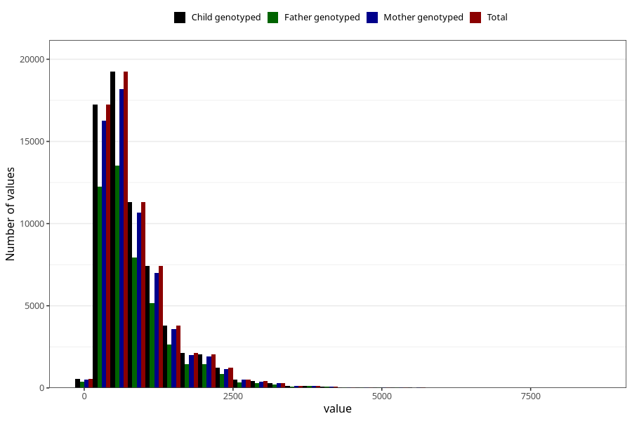

# retinol
Variable mapping to `RETINOL` in `Skjema2_beregning_CDW_v12`.
- Number of values:

| Value | Total | Child genotyped | Mother genotyped | Father genotyped |
| ----- | ----- | --------------- | ---------------- | ---------------- |
| Missing | 14320 | 14320 | 13635 | 6744 |
| Non-missing | 66685 | 66685 | 62982 | 46860 |
| 25th percentile | 426.09 | 426.09 | 426.1825 | 423.715 |
| 50th percentile | 663.2 | 663.2 | 663.165 | 656.265 |
| 75th percentile | 1084.25 | 1084.25 | 1083.485 | 1077.395 |
| Mean | 857.67532923446 | 857.67532923446 | 856.879970944079 | 851.686544814341 |
| Standard deviation | 648.750118049187 | 648.750118049187 | 647.157870543492 | 644.236904358437 |
| N | 66685 | 66685 | 62982 | 46860 |

