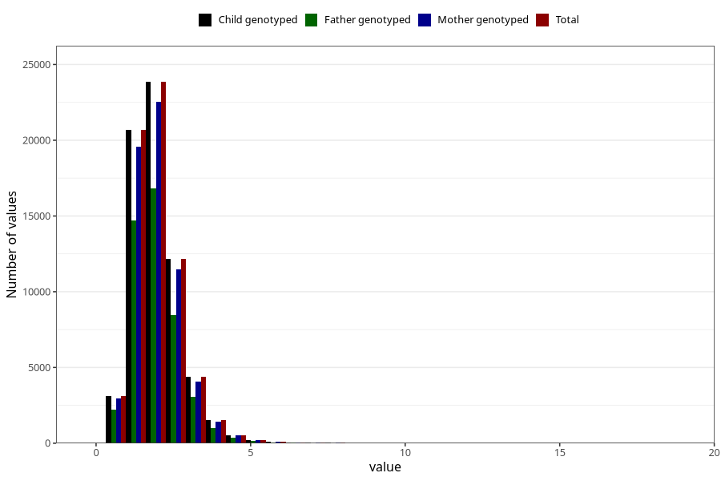

# riboflavin
Variable mapping to `RIBOFLAVIN` in `Skjema2_beregning_CDW_v12`.
- Number of values:

| Value | Total | Child genotyped | Mother genotyped | Father genotyped |
| ----- | ----- | --------------- | ---------------- | ---------------- |
| Missing | 14320 | 14320 | 13635 | 6744 |
| Non-missing | 66685 | 66685 | 62982 | 46860 |
| 25th percentile | 1.44 | 1.44 | 1.44 | 1.44 |
| 50th percentile | 1.84 | 1.84 | 1.84 | 1.83 |
| 75th percentile | 2.34 | 2.34 | 2.34 | 2.33 |
| Mean | 1.97012806478218 | 1.97012806478218 | 1.9684489219142 | 1.95813422962015 |
| Standard deviation | 0.810604296170708 | 0.810604296170708 | 0.810002068769243 | 0.791357144000311 |
| N | 66685 | 66685 | 62982 | 46860 |

