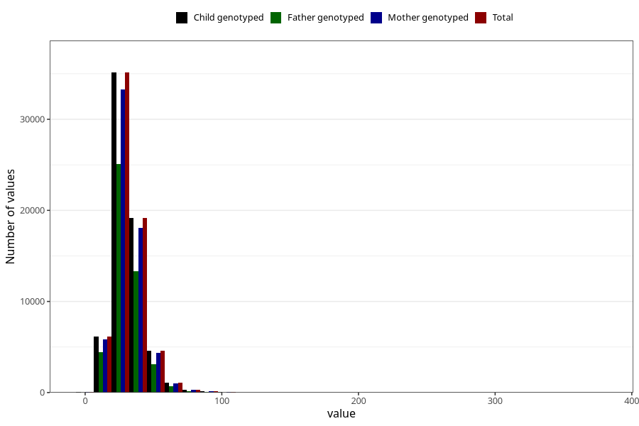

# saturated_fatty_acids
Variable mapping to `METTET` in `Skjema2_beregning_CDW_v12`.
- Number of values:

| Value | Total | Child genotyped | Mother genotyped | Father genotyped |
| ----- | ----- | --------------- | ---------------- | ---------------- |
| Missing | 14320 | 14320 | 13635 | 6744 |
| Non-missing | 66685 | 66685 | 62982 | 46860 |
| 25th percentile | 23.86 | 23.86 | 23.84 | 23.72 |
| 50th percentile | 29.41 | 29.41 | 29.39 | 29.18 |
| 75th percentile | 36.44 | 36.44 | 36.41 | 36.05 |
| Mean | 31.2863230111719 | 31.2863230111719 | 31.2570948842526 | 30.9563134869825 |
| Standard deviation | 11.611677770687 | 11.611677770687 | 11.5771550764375 | 11.2045992104912 |
| N | 66685 | 66685 | 62982 | 46860 |

