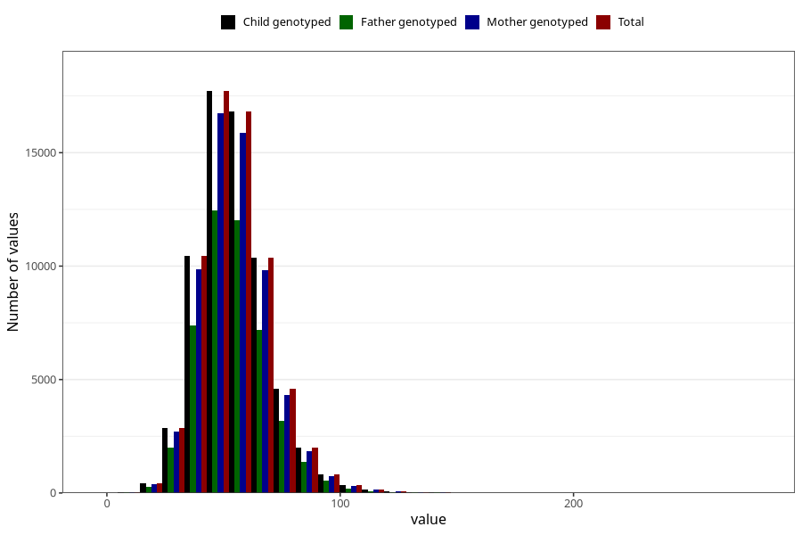

# selenium
Variable mapping to `SELEN` in `Skjema2_beregning_CDW_v12`.
- Number of values:

| Value | Total | Child genotyped | Mother genotyped | Father genotyped |
| ----- | ----- | --------------- | ---------------- | ---------------- |
| Missing | 14320 | 14320 | 13635 | 6744 |
| Non-missing | 66685 | 66685 | 62982 | 46860 |
| 25th percentile | 44.6 | 44.6 | 44.61 | 44.59 |
| 50th percentile | 53.3 | 53.3 | 53.3 | 53.26 |
| 75th percentile | 63.01 | 63.01 | 62.98 | 62.81 |
| Mean | 54.7430708555147 | 54.7430708555147 | 54.7179060684005 | 54.584612889458 |
| Standard deviation | 15.256442465323 | 15.256442465323 | 15.2067645162435 | 14.9668701906975 |
| N | 66685 | 66685 | 62982 | 46860 |

