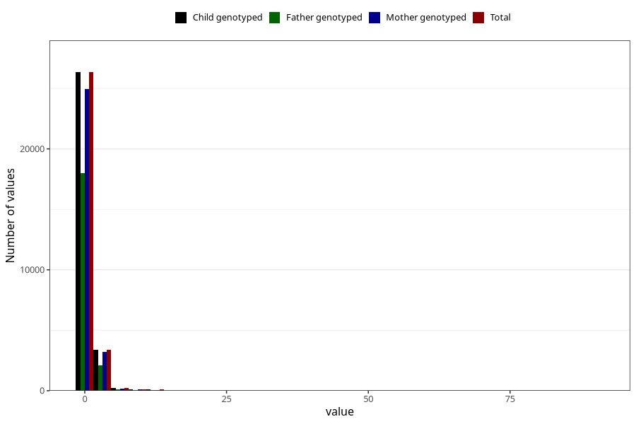

# soda_before
Variable mapping to `AA1395` in `Skjema1_v12`.
- Number of values:

| Value | Total | Child genotyped | Mother genotyped | Father genotyped |
| ----- | ----- | --------------- | ---------------- | ---------------- |
| Missing | 50884 | 50884 | 48112 | 33307 |
| Non-missing | 30121 | 30121 | 28505 | 20297 |
| Consumption have been reported by a mark but no amount given | 4 | 4 | 3 |2 |
| 25th percentile | 0 | 0 | 0 | 0 |
| 50th percentile | 0 | 0 | 0 | 0 |
| 75th percentile | 1 | 1 | 1 | 1 |
| Mean | 0.572168542683534 | 0.572168542683534 | 0.567293523261525 | 0.527716186252772 |
| Standard deviation | 1.40569293526479 | 1.40569293526479 | 1.3954875100737 | 1.3896121615248 |
| N | 30117 | 30117 | 28502 | 20295 |

