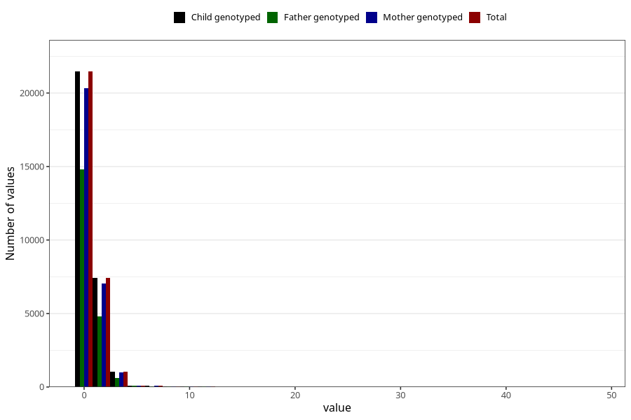

# soda_during
Variable mapping to `AA1396` in `Skjema1_v12`.
- Number of values:

| Value | Total | Child genotyped | Mother genotyped | Father genotyped |
| ----- | ----- | --------------- | ---------------- | ---------------- |
| Missing | 50724 | 50724 | 47945 | 33155 |
| Non-missing | 30281 | 30281 | 28672 | 20449 |
| Consumption have been reported by a mark but no amount given | 3 | 3 | 2 |1 |
| 0 | 21461 | 21461 | 20334 | 14784 |
| 1 | 5473 | 5473 | 5187 | 3565 |
| 2 | 1971 | 1971 | 1855 | 1256 |
| 3 | 216 | 216 | 202 | 121 |
| 4 | 823 | 823 | 772 | 503 |
| 5 | 103 | 103 | 99 | 69 |
| 6 | 81 | 81 | 80 | 55 |
| 7 | 15 | 15 | 15 | 9 |
| 8 | 54 | 54 | 50 | 33 |
| 9 | 5 | 5 | 5 | 5 |
| 10 | 30 | 30 | 27 | 20 |
| 11 | 3 | 3 | 3 | 2 |
| 12 | 36 | 36 | 35 | 22 |
| 14 | 1 | 1 | 1 | 0 |
| 16 | 2 | 2 | 2 | 1 |
| 20 | 1 | 1 | 1 | 1 |
| 28 | 1 | 1 | 0 | 0 |
| 48 | 2 | 2 | 2 | 2 |

