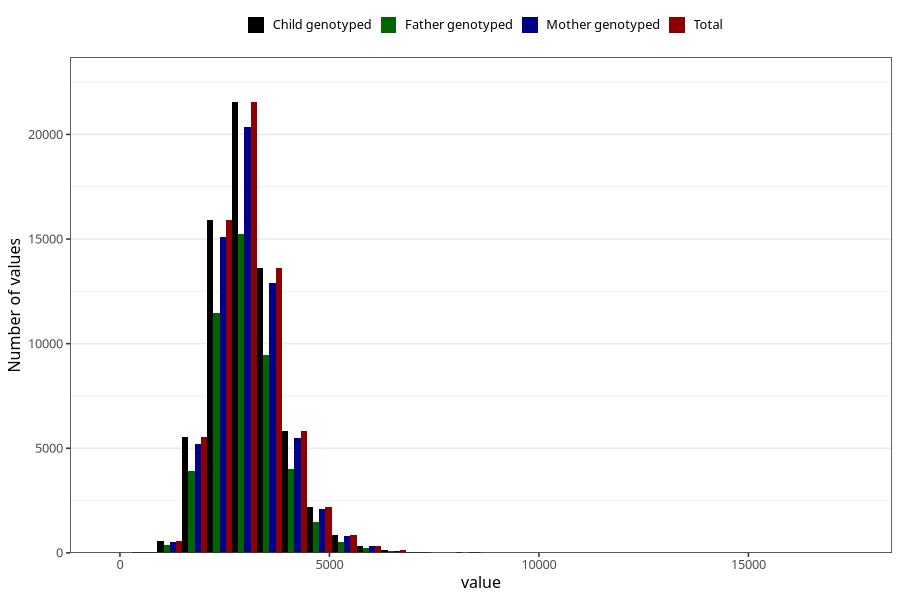

# sodium
Variable mapping to `NATRIUM` in `Skjema2_beregning_CDW_v12`.
- Number of values:

| Value | Total | Child genotyped | Mother genotyped | Father genotyped |
| ----- | ----- | --------------- | ---------------- | ---------------- |
| Missing | 14320 | 14320 | 13635 | 6744 |
| Non-missing | 66685 | 66685 | 62982 | 46860 |
| 25th percentile | 2515.61 | 2515.61 | 2515.465 | 2509.3075 |
| 50th percentile | 2972.09 | 2972.09 | 2971.27 | 2958.42 |
| 75th percentile | 3499.59 | 3499.59 | 3498.0575 | 3476.46 |
| Mean | 3059.38351848242 | 3059.38351848242 | 3058.05410212442 | 3041.41506978233 |
| Standard deviation | 832.873335096877 | 832.873335096877 | 829.89949049109 | 812.845487998872 |
| N | 66685 | 66685 | 62982 | 46860 |

