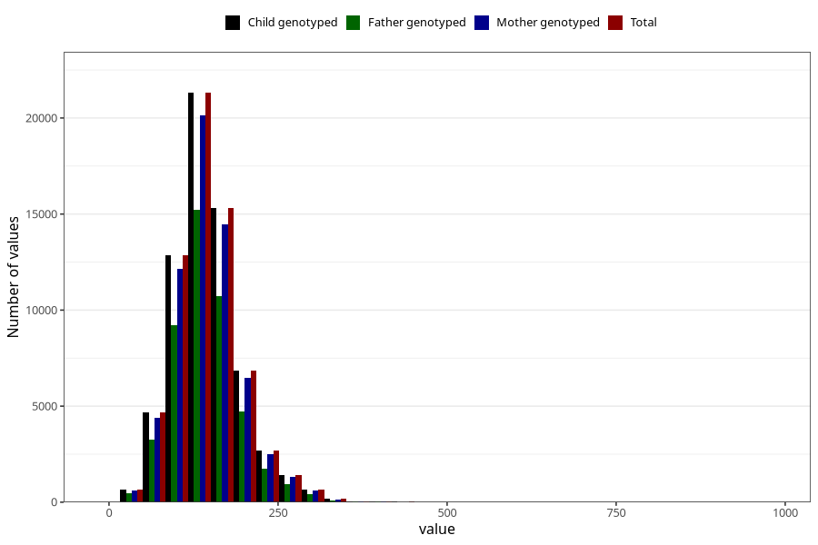

# starch
Variable mapping to `STIVELSE` in `Skjema2_beregning_CDW_v12`.
- Number of values:

| Value | Total | Child genotyped | Mother genotyped | Father genotyped |
| ----- | ----- | --------------- | ---------------- | ---------------- |
| Missing | 14320 | 14320 | 13635 | 6744 |
| Non-missing | 66685 | 66685 | 62982 | 46860 |
| 25th percentile | 114.49 | 114.49 | 114.5 | 114.18 |
| 50th percentile | 140.92 | 140.92 | 140.875 | 140.03 |
| 75th percentile | 170.75 | 170.75 | 170.6875 | 169.4525 |
| Mean | 145.869425507985 | 145.869425507985 | 145.799396494236 | 144.845064233888 |
| Standard deviation | 49.6518545086361 | 49.6518545086361 | 49.4368452709556 | 48.4519804272888 |
| N | 66685 | 66685 | 62982 | 46860 |

