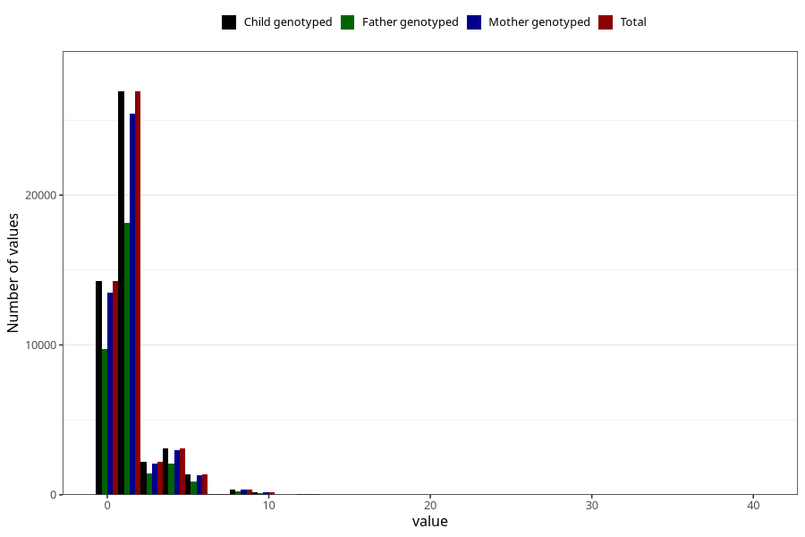

# tea_before
Variable mapping to `AA1386` in `Skjema1_v12`.
- Number of values:

| Value | Total | Child genotyped | Mother genotyped | Father genotyped |
| ----- | ----- | --------------- | ---------------- | ---------------- |
| Missing | 32484 | 32484 | 30688 | 20902 |
| Non-missing | 48521 | 48521 | 45929 | 32702 |
| Consumption have been reported by a mark but no amount given | 6 | 6 | 5 |5 |
| 0 | 14253 | 14253 | 13505 | 9722 |
| 1 | 15159 | 15159 | 14322 | 10286 |
| 2 | 11762 | 11762 | 11139 | 7871 |
| 3 | 2185 | 2185 | 2066 | 1436 |
| 4 | 3111 | 3111 | 2959 | 2076 |
| 5 | 534 | 534 | 504 | 344 |
| 6 | 846 | 846 | 795 | 539 |
| 7 | 50 | 50 | 50 | 31 |
| 8 | 372 | 372 | 349 | 234 |
| 9 | 15 | 15 | 13 | 11 |
| 10 | 152 | 152 | 148 | 97 |
| 12 | 49 | 49 | 47 | 34 |
| 14 | 6 | 6 | 6 | 5 |
| 15 | 4 | 4 | 4 | 3 |
| 16 | 6 | 6 | 6 | 3 |
| 20 | 6 | 6 | 6 | 3 |
| 24 | 3 | 3 | 3 | 1 |
| 30 | 1 | 1 | 1 | 0 |
| 40 | 1 | 1 | 1 | 1 |

