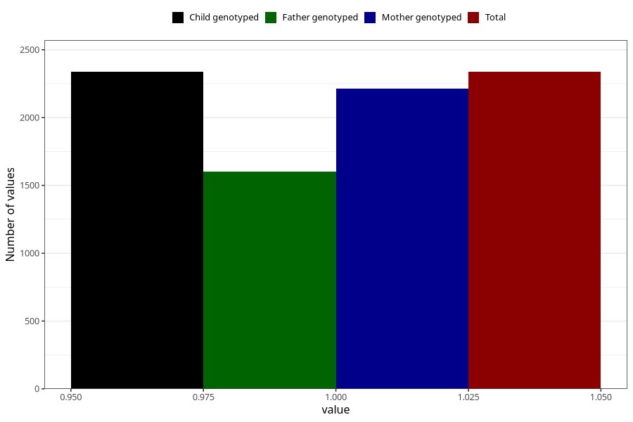

# tea_decaf
Variable mapping to `AA1388` in `Skjema1_v12`.
- Number of values:

| Value | Total | Child genotyped | Mother genotyped | Father genotyped |
| ----- | ----- | --------------- | ---------------- | ---------------- |
| Missing | 78668 | 78668 | 74403 | 52003 |
| Non-missing | 2337 | 2337 | 2214 | 1601 |
| 1 | 2337 | 2337 | 2214 | 1601 |

