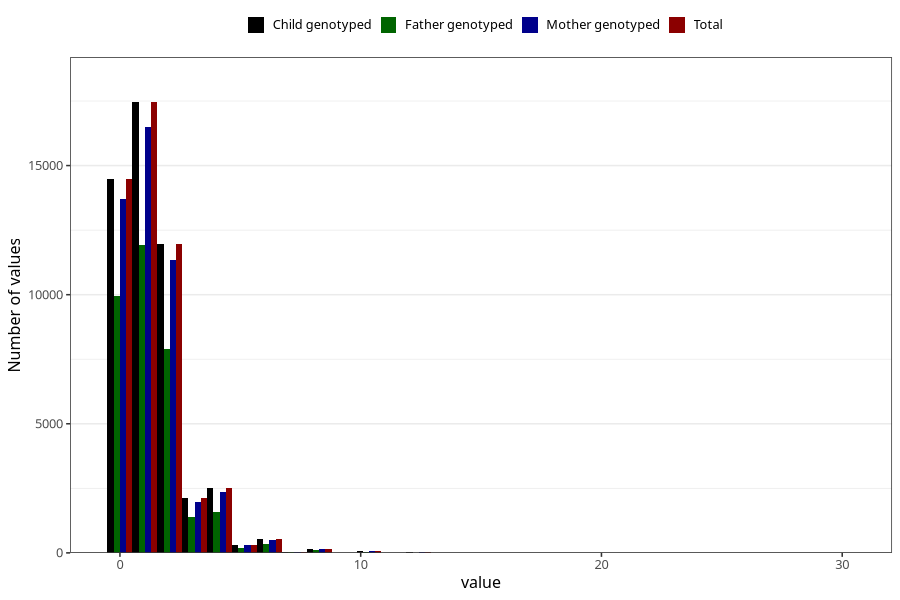

# tea_during
Variable mapping to `AA1387` in `Skjema1_v12`.
- Number of values:

| Value | Total | Child genotyped | Mother genotyped | Father genotyped |
| ----- | ----- | --------------- | ---------------- | ---------------- |
| Missing | 31376 | 31376 | 29623 | 20165 |
| Non-missing | 49629 | 49629 | 46994 | 33439 |
| Consumption have been reported by a mark but no amount given | 7 | 7 | 6 |6 |
| 0 | 14471 | 14471 | 13714 | 9939 |
| 1 | 17455 | 17455 | 16511 | 11918 |
| 2 | 11960 | 11960 | 11327 | 7888 |
| 3 | 2111 | 2111 | 1988 | 1374 |
| 4 | 2495 | 2495 | 2375 | 1600 |
| 5 | 313 | 313 | 297 | 191 |
| 6 | 518 | 518 | 494 | 336 |
| 7 | 34 | 34 | 34 | 24 |
| 8 | 167 | 167 | 158 | 113 |
| 9 | 8 | 8 | 7 | 3 |
| 10 | 59 | 59 | 54 | 29 |
| 11 | 2 | 2 | 2 | 1 |
| 12 | 17 | 17 | 15 | 9 |
| 14 | 3 | 3 | 3 | 3 |
| 15 | 2 | 2 | 2 | 2 |
| 16 | 3 | 3 | 3 | 1 |
| 20 | 3 | 3 | 3 | 2 |
| 30 | 1 | 1 | 1 | 0 |

