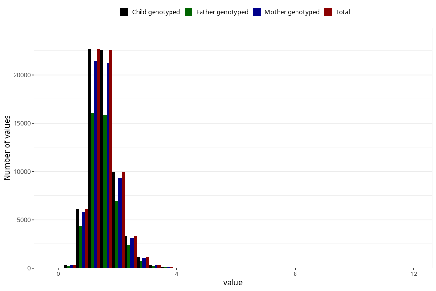

# thiamin
Variable mapping to `TIAMIN` in `Skjema2_beregning_CDW_v12`.
- Number of values:

| Value | Total | Child genotyped | Mother genotyped | Father genotyped |
| ----- | ----- | --------------- | ---------------- | ---------------- |
| Missing | 14320 | 14320 | 13635 | 6744 |
| Non-missing | 66685 | 66685 | 62982 | 46860 |
| 25th percentile | 1.23 | 1.23 | 1.23 | 1.23 |
| 50th percentile | 1.49 | 1.49 | 1.49 | 1.48 |
| 75th percentile | 1.79 | 1.79 | 1.79 | 1.79 |
| Mean | 1.55166859113744 | 1.55166859113744 | 1.5507114731193 | 1.54335894152796 |
| Standard deviation | 0.493758719561432 | 0.493758719561432 | 0.492283341011491 | 0.481021477756304 |
| N | 66685 | 66685 | 62982 | 46860 |

