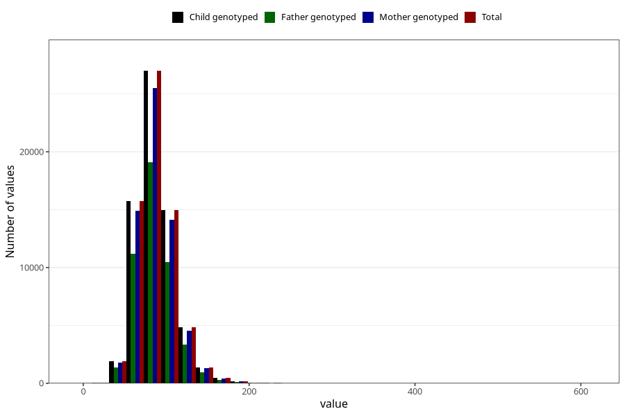

# tot_prot
Variable mapping to `TOT_PROT` in `Skjema2_beregning_CDW_v12`.
- Number of values:

| Value | Total | Child genotyped | Mother genotyped | Father genotyped |
| ----- | ----- | --------------- | ---------------- | ---------------- |
| Missing | 14320 | 14320 | 13635 | 6744 |
| Non-missing | 66685 | 66685 | 62982 | 46860 |
| 25th percentile | 72.17 | 72.17 | 72.14 | 72.08 |
| 50th percentile | 84.59 | 84.59 | 84.56 | 84.32 |
| 75th percentile | 99.16 | 99.16 | 99.09 | 98.72 |
| Mean | 87.4643441553573 | 87.4643441553573 | 87.4173279667206 | 87.0639923175416 |
| Standard deviation | 23.8025779290279 | 23.8025779290279 | 23.74558104681 | 23.1913794136507 |
| N | 66685 | 66685 | 62982 | 46860 |

